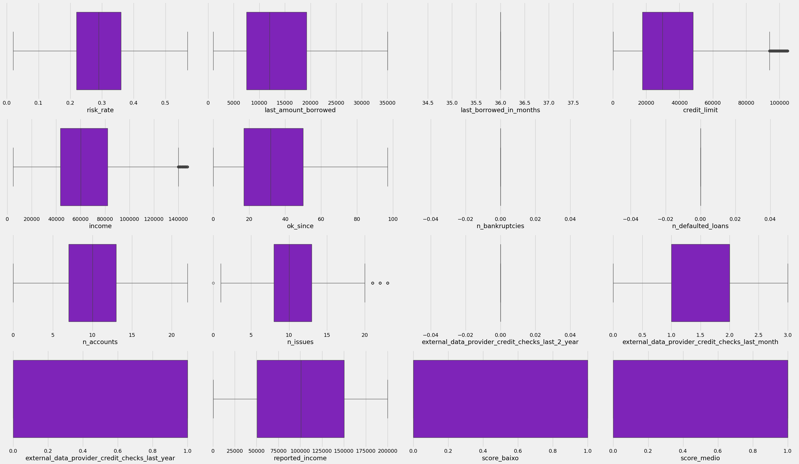
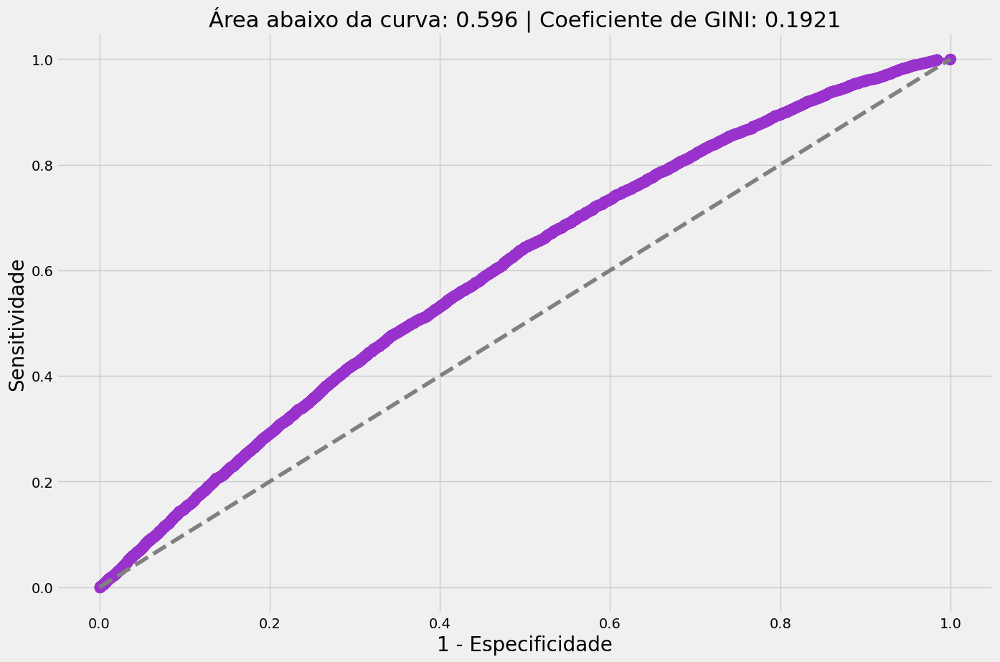

# Previsão de Risco de Crédito - NuBank

## 1. Descrição 

- A avaliação de risco de crédito é um processo crucial para instituições financeiras como o Nubank, uma fintech que revolucionou o setor bancário com foco em simplicidade, tecnologia e personalização. Esse processo visa identificar a capacidade e a probabilidade de um cliente cumprir suas obrigações financeiras, garantindo que o crédito seja concedido de forma responsável e sustentável.
Cada vez mais, soluções vêm sendo desenvolvidas e aprimoradas visando minimizar o risco de default.

- Default é o termo utilizado para indicar o não cumprimento das obrigações e/ou condições de um empréstimo (como financiamentos ou dívidas de cartão de crédito). Normalmente, o principal motivo para o descumprimento das condições de pagamento é a incapacidade financeira do cliente.

## 2. Como Funciona a Avaliação de Risco de Crédito

### Análise de Dados Alternativos

- Os bancos utilizam fontes de dados alternativos para analisar o perfil de seus clientes. Além de dados convencionais como histórico de crédito (score do Serasa ou SPC), a empresa analisa informações comportamentais coletadas de maneira ética e transparente.

### Modelos de Machine Learning

- A avaliação de crédito dos bancos hoje em dia é altamente tecnológica. A empresa usa algoritmos de machine learning para processar grandes volumes de dados e identificar padrões. Esses modelos são ajustados continuamente, aprendendo com o comportamento real dos clientes para oferecer uma análise mais precisa e personalizada.

### Customização de Limites

- Com base nos dados analisados, os bancos oferecem limites personalizados para seus clientes. Isso permite que a empresa conceda crédito de forma gradativa, aumentando o limite conforme o cliente demonstra bom comportamento financeiro, como o pagamento pontual de faturas.

### Transparência no Processo

- Os bancos precisam de transparência com os clientes. Por exemplo, se um pedido de aumento de limite for negado, os bancos explicam os motivos e oferecem dicas práticas para melhorar a análise de crédito futura.

# Contextualização do Problema

Neste problema, o objetivo é prever qual a probabilidade de um cliente da Startup Nubank não cumprir com suas obrigações financeiras e deixar de pagar a sua fatura do Cartão de Crédito.

Vale ressaltar que essa avaliação deve ser realizada no momento em que o cliente solicita o cartão (normalmente no primeiro contato com a instituição).

**OBJETIVO: Criar um modelo que forneça a probabilidade de um cliente virar inadimplente.**

# Relatório Análise Univariada

- Entre os **Scores**, o Score 3 é o mais diversificado para uma análise bi e multivariada, onde o score **340.0** é o valor mais frequente.

- Em **Risk Rate** o valor de **0.29** é o valor mais frequente, onde o valor máximo registrado é de **0.57**.

- Em **Last Amount Borrowed** o valor de **12,024.02** é o mais frequente, e praticamente isolado, pois em segundo lugar vem o valor de 10022.75 com apenas 3 registros.

- Em **Last Borrowed in Months** **36,0** meses é o intervalo com mais frequência.

- Em **Credit Limit** o valor de **29,942.00** é o valor mais frequente, e praticamente isolado, pois em segundo lugar vem o valor de **10,000.0** com apenas **107** registros.

- Em **Income** o valor de **60,022.37** é o mais frequente, e praticamente isolado, pois em segundo lugar vem o valor de **75,017.74** com apenas 5 registros.

- Em **Ok Since** temos o valor de **32,0** com mais frequência e praticamente isolado, com **20,084** registros.

- Em **N Bankruptcies** podemos ver que os clientes não tiveram declaração de falência.

- Em **N Defaulted Loans** podemos ver que número de empréstimos não possuem inadimplência.

- Em **N Accounts** podemos ver que grande parte dos clientes possuem mais de **5** a **10** contas ou créditos em seus nomes.

- Em **N Issues** podemos ver que **10** problemas ou ocorrências, irregularidades associadas as contas dos clientes são mais frequentes, seguidas de 9, 8 e 11 ocorrências.

- Em **External Data Provider Credit Checks Last 2 Years** possuem **0** quantidade de consultas.

- **External Data Provider Credit Checks Last Month** já é um pouco diferente. **2** é o números mais frequente de vezes que provedores externos consultaram o histórico de crédito no mês anterior.

- Em **External Data Provider Credit Checks Last Year** **1** que siginica True é o numero com mais frequência em consultas dos dados históricos de crédito.

- Em **Reported Income** o valor de 100,720.00 é o mais frequente. Em segundo lugar vem o valor de 26,601.00.

- Em **Shipping State** é basicamente o registro dos estados onde se localizam cada cliente. **SP** é o estado com mais frequência.

- E em **Target Default** podemos ver que há mais registros **positivos** com relação aos créditos.

# Relatório Análise Bivariada

Sobre as correlações feitas com **Diagramas de Dispersão**, **Correlação de Pearson**, e verificação de **Multicolinearidade** e utilização do **VIF(Variance Inflation Factor)**:

- Não foi detectado correlações significativas entre as variáveis utilizando as técnicas mencionadas. 

- As Correlações de Pearson ficaram abaixo de **0.50**, apenas duas variáveis tiveram um valor de **0.84**. 

- No teste do VIF, os valores de quase todas as variáveis ficaram abaixo de **5.0**, que é o aceitável para a inexistência de multicolinearidade, e correlação, apenas a variável last_borrowed_in_months ficou com valor de 1,222.99, provavelmente é um erro.

**Perguntas de Negócio**

Foram criadas perguntas de negócio iniciais para os ****Médios - Score 3 de 301 até 700****, que significa um médio risco de inadimplência. 

Com isso detectamos as seguintes informações:

- Há clientes com **Médios - Score 3 de 301 até 700** que possuem **Risk Rate maior do que 0.50**, significando um certo risco de inadimplência.

- Há clientes com **Médios - Score 3 de 301 até 700** que fizeram últimos empréstimos maiores que **20.000**.

- Há clientes com **Médios - Score 3 de 301 até 700** com limite de crédito maior que **50.000**.

- Há clientes com **Médios - Score 3 de 301 até 700** com Renda entre **10.000 a 30.000**.

- Há clientes com **Médios - Score 3 de 301 até 700** com **OK Since** entre **5 meses a 10 meses**. Isso significa que há possível inadimplência.

- Há clientes com **Médios - Score 3 de 301 até 700** com 0 registros de falência.

- Há clientes com **Médios - Score 3 de 301 até 700** que possuem mais de **1 conta**.

- Há clientes com **Médios - Score 3 de 301 até 700** que possuem problemas (n_issues) maiores do que **1**.

- Há clientes com **Médios - Score 3 de 301 até 700** que possuem o "número de vezes que um provedor de dados externo realizou uma verificação de crédito sobre uma pessoa no último mês."**(external_data_provider_credit_checks_last_month)** maiores do que **1**. Isso significa que houve checagem na verificação de crédito.

- Há clientes com **Médios - Score 3 de 301 até 700** que possuem "número de vezes que um provedor de dados externo realizou uma verificação de crédito sobre uma pessoa no último ano."(**external_data_provider_credit_checks_last_year**) igual a 1. Isso também significa que houve checagem na verificação de crédito.

- Há clientes com **Médios - Score 3 de 301 até 700** que possuem Renda Reportada maior que **100.000**.

- Há clientes com **Médios - Score 3 de 301 até 700** que estão em outros estados além de **SP**.

- Há clientes com **Médios - Score 3 de 301 até 700** que posseum inadimplência **(target_default = 1)**.

# Relatório Inicial Modelagem

- Dados e Pré-processamento

Importação e análise prévia do dataset com informações como histórico de crédito, renda, score de crédito, entre outros.

Tratamento de dados: exclusão de variáveis irrelevantes, tratamento de valores ausentes e outliers, e transformação de variáveis categóricas em numéricas usando One-Hot Encoding.

Divisão dos dados em conjuntos de treino e teste para evitar vazamento de dados (data leakage).

- Modelagem

Utilização de Regressão Logística Binária para modelar a probabilidade de inadimplência.

Aplicação do método Stepwise para seleção de variáveis, mantendo apenas as mais relevantes.

Criação de uma nova variável, 'phat', que armazena as probabilidades previstas pelo modelo.

- Avaliação do Modelo

Matriz de confusão: análise com ponto de corte (cutoff) de 20% e cálculo de métricas como sensibilidade, especificidade e acurácia.

Curva ROC: construção da curva e cálculo da Área Sob a Curva (AUC) e do Coeficiente de Gini.

- AUC: 0.596
- Coeficiente de Gini: 0.192

- Pipeline de Machine Learning

Implementação de um pipeline para padronização dos dados usando StandardScaler.

Comparação inicial de modelos com Regressão Logística e XGBoost, com avaliação de desempenho via validação cruzada.

Esse resultado baixo da curva ROC demonstra principalmente que precisamos de mais variáveis, a qualidade dos dados e a escolha das variáveis têm um impacto enorme no desempenho do modelo. 